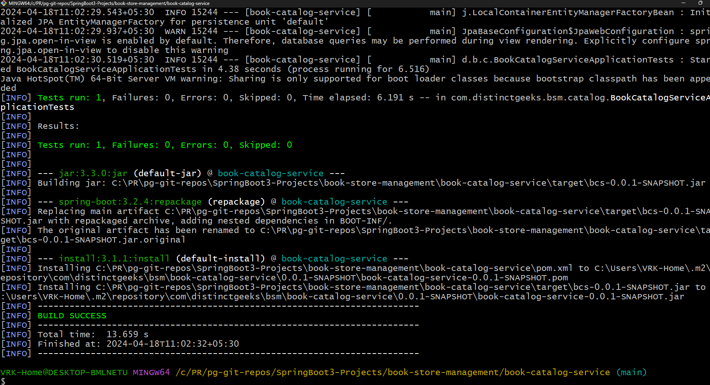
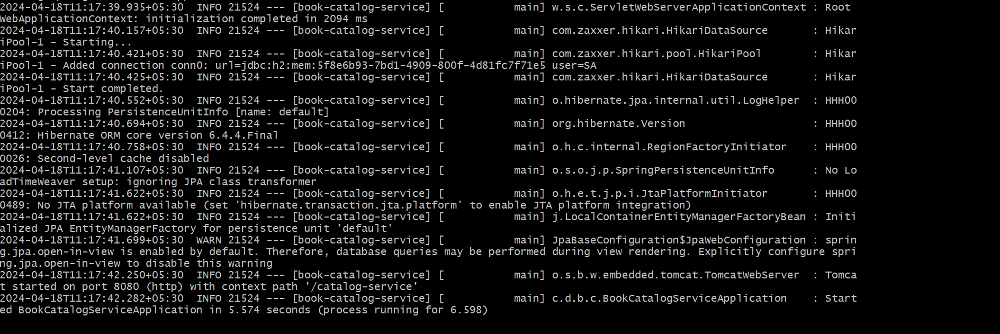
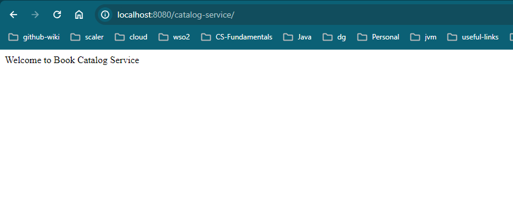

This service provides REST APIs for managing books catalog.

### How to Build and Run on localhost?
- Clone the repository
- Goto parent directory(where pom.xml) exists.
- execute build command
```shell
 ./mvnw clean install
```
- Once the build is successful, then you will see below screen


- After a successful build, you can run your application by using bootJar
```shell
  ./mvnw spring-boot:run
```
**OR**
- you can run bootJar by using `java` command
- bootJar filename: `book-catalog-service-${project.version}.jar`

````shell
  java -jar ./target/book-catalog-service-${project.version}.jar
````

- Check your application is successfully started or not.



- Once your application is up and running test with url:http://localhost:8080/catalog-service/ on any browser. Output should look like below



