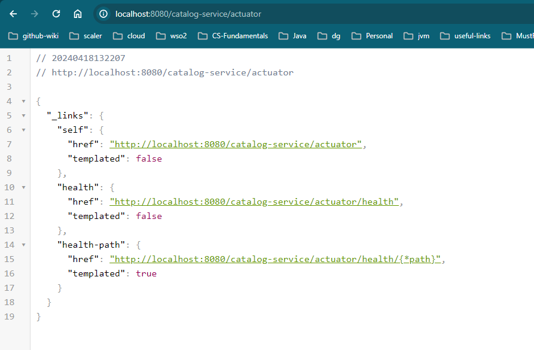
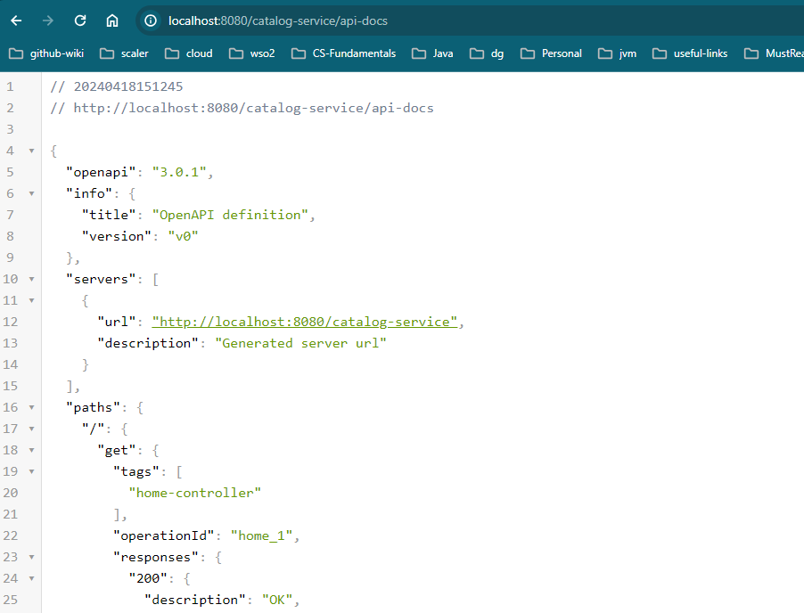
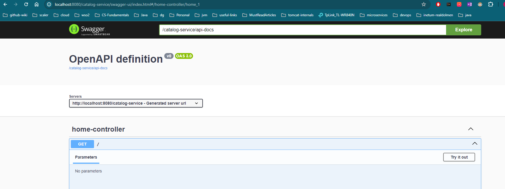
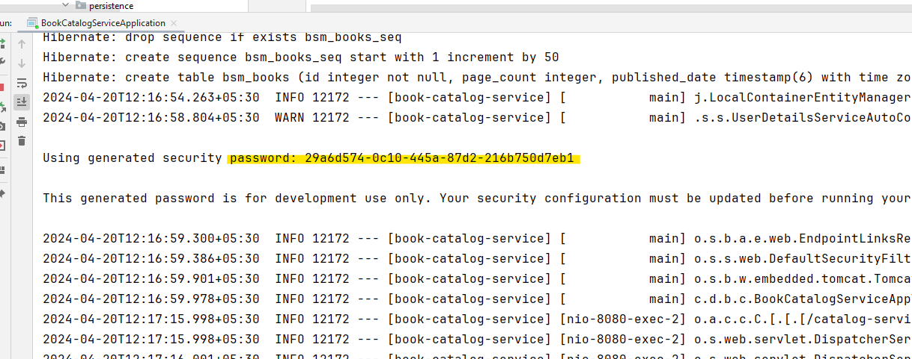
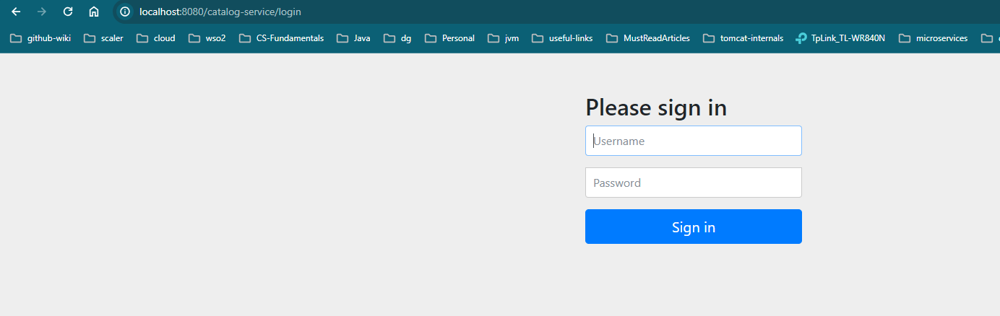

# Questions which are good to know while building the project

<details>

<summary> 1. How to add actuator for monitoring?</summary>

### Actuator Reference Docs: https://docs.spring.io/spring-boot/docs/current/reference/html/actuator.html

### Steps:
1. Add maven dependency
```xml
    <dependency>
        <groupId>org.springframework.boot</groupId>
        <artifactId>spring-boot-starter-actuator</artifactId>
    </dependency>
```
2. Build and Run the project then browse the url: http://localhost:8080/catalog-service/actuator



3. Enable all the available Actuator APIs for monitoring. Add below properties to `applications.properties` file

````properties
   management.endpoints.web.exposure.include=*
   management.endpoints.web.exposure.exclude=env,beans
````
4. Go through above documentation link for customization.

</details>

<details>

<summary>2. How to add OpenAPI and Swagger-UI to the project? </summary>

#### Notes:
- The `springdoc-openapi` library helps to automate the generation of Spring-based REST APIs in OpenAPI 3.0 format.
- It examines the application at runtime to infer API semantics based on class annotations and configuration beans.
- By default, SpringDoc automatically generates documentation in JSON/YAML formats. 
- When Swagger UI is enabled, it uses Swagger API to generate the documentation in HTML format, too.
### Steps:
1. If you want both OpenAPI doc + Swagger UI both then you can add the below dependency.

```xml
   <dependency>
        <groupId>org.springdoc</groupId>
        <artifactId>springdoc-openapi-starter-webmvc-ui</artifactId>
        <version>2.4.0</version>
    </dependency>
```
- reference for version: https://mvnrepository.com/artifact/org.springdoc/springdoc-openapi-starter-webmvc-ui

2. If you want to **exclude Swagger-UI (HTML doc)** and want to generate only OpenAPI documentation in JSON/YAML formats, then add below dependency.
```xml
<dependency>
    <groupId>org.springdoc</groupId>
    <artifactId>springdoc-openapi-starter-webmvc-api</artifactId>
    <version>2.4.0</version>
    <scope>test</scope>
</dependency>

```
- Add only one dependency either with Swagger-UI or without Swagger-UI

3. After adding above dependency and enable open-api docs and enable swagger ui

- References: https://springdoc.org/ and https://springdoc.org/properties.html

```properties
springdoc.api-docs.enabled=true
springdoc.api-docs.path=/api-docs
springdoc.swagger-ui.enabled=true
springdoc.swagger-ui.path=/swagger-ui

```

4. Rebuild and Rerun the application and validate it by using below two urls.
- To validate OpenAPI docs: http://localhost:8080/catalog-service/api-docs



- To validate Swagger UI: http://localhost:8080/catalog-service/swagger-ui



5. If you want to share your APIs with others, then you can share either api-docs or swagger-ui urls.

</details>

<details>
<summary>3. create an end-to-end API with book data model</summary>
</details>

<details>
<summary>4. How to add lombok to a current project? </summary>

## References: https://projectlombok.org/setup/maven
### Steps:
1. Add lombok dependency

```xml
<dependency>
    <groupId>org.projectlombok</groupId>
    <artifactId>lombok</artifactId>
    <version>1.18.32</version>
    <scope>provided</scope>
</dependency>
```

2. After rebuild validate it by adding `@Data` from `import lombok.Data;`

</details>

<details>

<summary>5. How add DB Configuration and load initial Data to the DB ? </summary>

__Notes:__
- In our project we are configuring H2 DB but configuration is almost same for all the DBs.

__References:__
1. https://www.baeldung.com/spring-boot-h2-database
2. https://www.h2database.com/html/quickstart.html
3. https://docs.spring.io/spring-boot/docs/current/reference/html/howto.html#howto.data-initialization
4. https://www.baeldung.com/spring-boot-data-sql-and-schema-sql
5. https://stackoverflow.com/questions/30549489/what-is-this-spring-jpa-open-in-view-true-property-in-spring-boot
6. https://www.baeldung.com/spring-open-session-in-view
Exception:
Any string column data with more than 256 chars:
   org.h2.jdbc.JdbcSQLSyntaxErrorException: The name that starts with "Unlocking Android: A Developer's" is too long. The maximum length is "256"; SQL statement:
- Need to analyse.
- 

</details>

<details>

<summary>6. How to add Spring Security?</summary>

- Spring Boot provides a `spring-boot-starter-security` starter that aggregates Spring Security-related dependencies.

### Steps:

- Dependency:
```xml
<dependency>
    <groupId>org.springframework.boot</groupId>
    <artifactId>spring-boot-starter-security</artifactId>
</dependency>
```
- After adding this dependency if you rerun the application, immediately default spring-security applies to the application without any configuration.
- Defualt username: user and the Password will be generated during application startup.

  

- if you try to access any api from the browser, then the application shows a default login form and default password is displayed on the startup console.



- if you want to overwrite default username and password add below properties

```properties
spring.security.user.name=user1
spring.security.user.password=pwd1
```
- Now we can use above uname and pwd for login.
- Use Basic Auth on postman request otherwise it will show `401 Unauthorized` error


### How to authentication configuration?

- 

- 


### References:
1. https://docs.spring.io/spring-security/reference/index.html
2. Sample Projects: https://github.com/spring-projects/spring-security-samples/tree/6.2.x/servlet/spring-boot/java
3. 

</details>